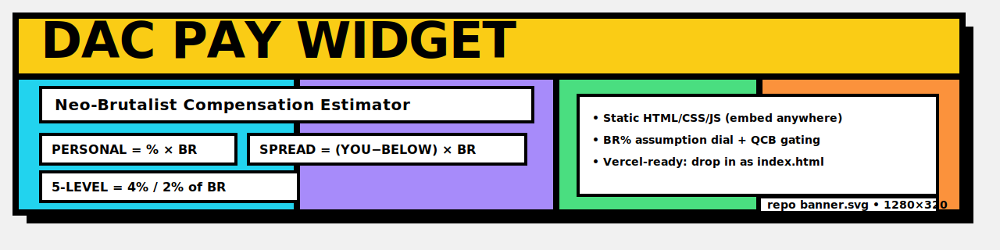

# DAC Pay Widget (Neo-Brutalist)

An embeddable HTML/CSS/JS widget that estimates DAC compensation: **Personal commission**, **Override Spread**, and **5-Level Pay**.  
Includes a configurable **BR% of funding** assumption and a **QCB toggle** to gate overrides.

## What’s included
- `public/index.html` — the widget (Neo-Brutalist UI + calculator logic)
- `assets/repo-banner.svg` — repo banner
- `vercel.json` — headers that allow iframe embedding

## Quick start (local)
You can open the widget directly in a browser:

1. Open `public/index.html`

## Deploy to Vercel
1. Push this repo to GitHub
2. In Vercel: **New Project → Import Repo → Deploy**
3. Your widget will be live at: `https://YOUR-PROJECT.vercel.app/`

> If you keep `public/index.html`, Vercel will still serve it at the root URL.

## Embed (Wix / Webflow / Squarespace / any site)
Paste this into an HTML embed block (replace the URL):

```html
<div style="width:100%;max-width:980px;margin:0 auto;">
  <iframe
    src="https://YOUR-PROJECT.vercel.app/"
    style="width:100%;height:920px;border:0;border-radius:18px;overflow:hidden;"
    title="DAC Pay Estimator"
    loading="lazy"
  ></iframe>
</div>
