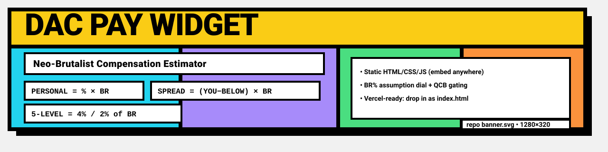

Here is the revised `README.md` with the placeholder URL updated to the live deployment link:

```markdown


# DAC Pay Widget (Neo-Brutalist)

An interactive, embeddable HTML/CSS/JS widget designed to estimate David Allen Capital (DAC) compensation. Built with a striking Neo-Brutalist user interface, this tool provides real-time estimations for **Personal commission**, **Override Spread**, and **5-Level Pay**.

## 🚀 Features
- **Configurable BR% Assumption:** Users can adjust the Bonus Revenue percentage to match typical outcomes for different products.
- **QCB Logic Gate:** A simple toggle to enable or restrict Override Spread and 5-Level pay calculations based on QCB status.
- **Advanced 5-Level Inputs:** Switch between a simple team model or an advanced breakdown by specific downline levels.
- **Dynamic "Copy Embed" Button:** Users can generate and copy an `<iframe>` snippet instantly to embed the calculator on their own sites.
- **Responsive Neo-Brutalist UI:** Sharp corners, high-contrast borders, and stark colors that look great on both desktop and mobile devices.

## 🛠️ Tech Stack
- **HTML5 & CSS3:** Utilizing CSS variables for easy theming and Flexbox/Grid for responsive layouts.
- **Vanilla JavaScript:** Zero dependencies. Lightweight, fast, and secure.
- **Google Fonts:** Uses *Space Grotesk* to complement the brutalist design aesthetic.

## 📁 Repository Structure
- `public/index.html` — The core widget containing all markup, styles, and calculation logic.
- `assets/repo-banner.svg` — Visual banner for the repository.
- `vercel.json` — Deployment configuration overriding default iframe restrictions to allow cross-origin embedding.

## 💻 Quick Start (Local Development)
Because this project uses vanilla web technologies, no build step is required!
1. Clone the repository to your local machine.
2. Navigate to the `public/` directory.
3. Open `index.html` directly in any modern web browser.

## 🚀 Deployment

### Option A: Vercel (Recommended)
This repository is pre-configured for Vercel. The included `vercel.json` file ensures that the proper `Content-Security-Policy` headers are set so the widget can be embedded anywhere.
1. Push your code to GitHub.
2. In Vercel, go to **New Project** → **Import Repo** → **Deploy**.
3. Your widget will be live at `https://dac-pay.vercel.app/`.

### Option B: Netlify or GitHub Pages
You can also host this directory on Netlify or GitHub Pages. 
*Note: If hosting outside of Vercel, ensure your hosting provider is configured to allow `frame-ancestors *` in the HTTP headers if you experience embedding blocks.*

## 🌐 How to Embed the Widget
Once deployed, the widget can be embedded on any website builder (Wix, Webflow, Squarespace, WordPress) using a standard HTML iframe.

Users can use the **Copy Embed Code** button on the live widget, or you can manually paste the following snippet into an HTML block:

```html
<div style="width:100%;max-width:980px;margin:0 auto;">
  <iframe
    src="[https://dac-pay.vercel.app/](https://dac-pay.vercel.app/)"
    style="width:100%;height:850px;border:none;overflow:hidden;"
    title="DAC Pay Estimator"
    loading="lazy"
  ></iframe>
</div>
```
```
